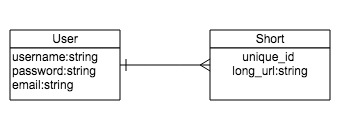

== README

== Ty.Ny Url Shortener

### GA WDI DC August 2014, Project 1

### Overview

**Ty.Ny** is a URL shortener with basic user functions. The overall goal was to create a functional shortener that would route back to the original link using Bitly's API. Having pivoted between three different project ideas, I settled on this with roughly two days worth of time from conception to this working model.

*Future Plans* include adding User functionality beyond signing in and signing out-- e.g. user's will be able to reference their previous links on their user profiles and track how many times each link was clicked. 

Visit Ty.Ny! - http://damp-fjord-4387.herokuapp.com/

### Technologies Used

* Ruby 2.1.1
* Ruby on Rails 4.1.1
* PostgreSQL Database
* Authentication & Authorization provided by Devise
* CSS styling (for fanciful look-stuffs!)

### User Stories Completed

* As a user I can sign up for an account on the site
* As a user I can log into my account
* As a user I can loff off of my account
* As a user I can create a shortened link

### ERD

